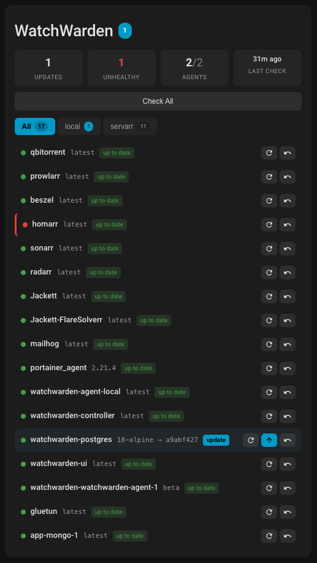
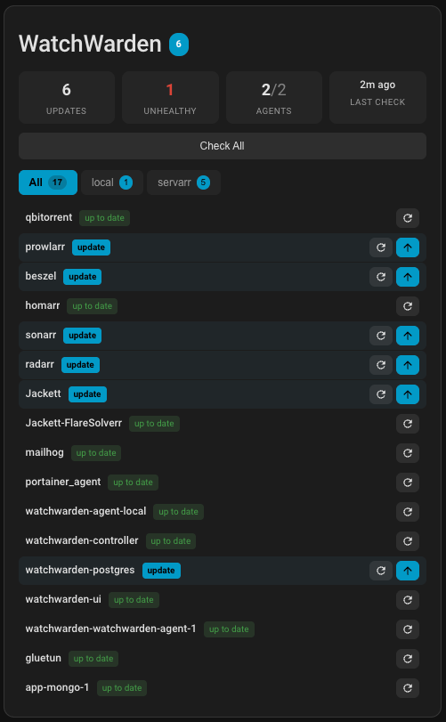
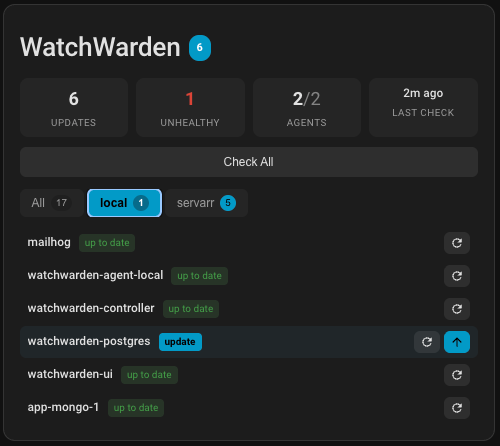
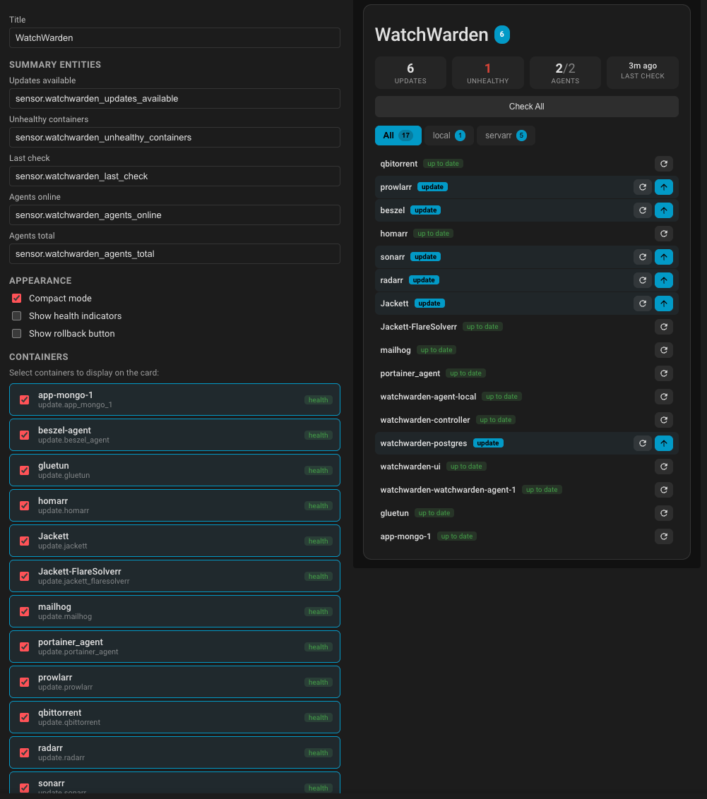

# WatchWarden Card

[](https://github.com/watchwarden-labs/watchwarden-custom-card/releases/latest)
[](https://github.com/hacs/integration)
[](LICENSE)

A Home Assistant Lovelace custom card for [WatchWarden](https://github.com/watchwarden-labs/watchwarden) — view Docker container update status and trigger actions directly from your dashboard.



## Prerequisites

- A running WatchWarden controller
- The [WatchWarden HA integration](https://github.com/watchwarden-labs/watchwarden-ha-integration) installed and configured

## Installation

### HACS (recommended)

[](https://my.home-assistant.io/redirect/hacs_repository/?owner=watchwarden-labs&repository=watchwarden-custom-card&category=plugin)

1. Open HACS in your Home Assistant instance
2. Click the three dots menu > **Custom repositories**
3. Add `https://github.com/watchwarden-labs/watchwarden-custom-card` with category **Dashboard**
4. Search for "WatchWarden Card" and install
5. Add the resource if prompted, or manually:
   ```yaml
   url: /hacsfiles/watchwarden-custom-card/watchwarden-card.js
   type: module
   ```
6. Refresh the browser

### Manual

1. Download `watchwarden-card.js` from the [latest release](https://github.com/watchwarden-labs/watchwarden-custom-card/releases)
2. Copy to `/config/www/watchwarden-card.js`
3. Add as a Lovelace resource:
   - **Settings > Dashboards > Resources > Add**
   - URL: `/local/watchwarden-card.js`
   - Type: JavaScript Module
4. Refresh the browser

### Build from source

```bash
npm install
npm run build
cp dist/watchwarden-card.js /config/www/watchwarden-card.js
```

## Configuration

Add the card to your dashboard via the UI card picker (search "WatchWarden") or manually in YAML.

### Minimal example

```yaml
type: custom:watchwarden-card
summary_entities:
  containers_with_updates: sensor.watchwarden_updates_available
  unhealthy_containers: sensor.watchwarden_unhealthy_containers
  last_check: sensor.watchwarden_last_check
containers:
  - name: Traefik
    update_entity: update.traefik_update
  - name: Home Assistant
    update_entity: update.home_assistant_update
```

### Full example

```yaml
type: custom:watchwarden-card
title: WatchWarden
summary_entities:
  containers_with_updates: sensor.watchwarden_updates_available
  unhealthy_containers: sensor.watchwarden_unhealthy_containers
  last_check: sensor.watchwarden_last_check
  agents_online: sensor.watchwarden_agents_online
  agents_total: sensor.watchwarden_agents_total
containers:
  - name: Traefik
    update_entity: update.traefik_update
    health_entity: binary_sensor.traefik_health
  - name: Sonarr
    update_entity: update.sonarr_update
    health_entity: binary_sensor.sonarr_health
  - name: Radarr
    update_entity: update.radarr_update
appearance:
  compact: false
  show_health: true
  show_rollback: true
```

## Config reference

| Key | Type | Required | Description |
|-----|------|----------|-------------|
| `title` | string | No | Card title (default: "WatchWarden") |
| `summary_entities.containers_with_updates` | entity_id | Yes | Sensor for update count |
| `summary_entities.unhealthy_containers` | entity_id | Yes | Sensor for unhealthy count |
| `summary_entities.last_check` | entity_id | Yes | Sensor for last check time |
| `summary_entities.agents_online` | entity_id | No | Sensor for online agents |
| `summary_entities.agents_total` | entity_id | No | Sensor for total agents |
| `containers[].name` | string | Yes | Display name |
| `containers[].update_entity` | entity_id | Yes | Update entity for this container |
| `containers[].health_entity` | entity_id | No | Binary sensor for health |
| `appearance.compact` | boolean | No | Compact row layout (default: false) |
| `appearance.show_health` | boolean | No | Show health dots (default: true) |
| `appearance.show_rollback` | boolean | No | Show rollback buttons (default: false) |

## Features

- Summary stats: updates available, unhealthy containers, agents online, last check time
- Per-container status with version info and health indicators
- Agent tabs for multi-host setups
- Action buttons: Check All, Check, Update, Rollback
- Compact mode for dense dashboards
- Visual editor for easy configuration
- Dark theme native (uses HA CSS variables)

### Compact mode with agent tabs

<p float="left">
  
  
</p>

### Visual editor

The editor auto-discovers all WatchWarden containers — just check the boxes:



## How it works

The card reads **only** from Home Assistant entities and services. It does not make any direct HTTP calls to the WatchWarden API. All data comes from the `watchwarden` HA integration.

- **Check All**: calls `watchwarden.check_all` service
- **Check**: calls `watchwarden.check_container` service with `container_id` from entity attributes
- **Update**: calls `update.install` service (HA native update platform)
- **Rollback**: calls `watchwarden.rollback_container` service

## Development

```bash
npm install
npm run watch  # rebuilds on file change
```

Copy the output to your HA instance and refresh.

## License

MIT
